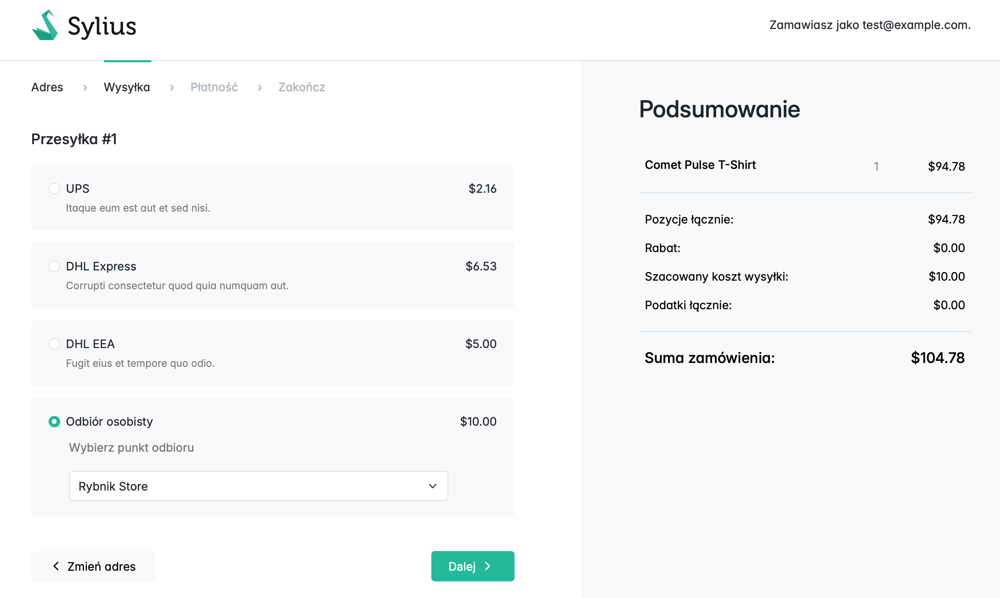
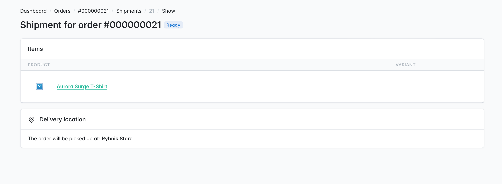
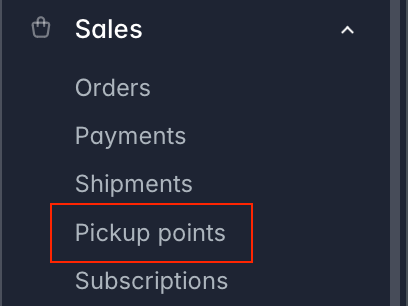
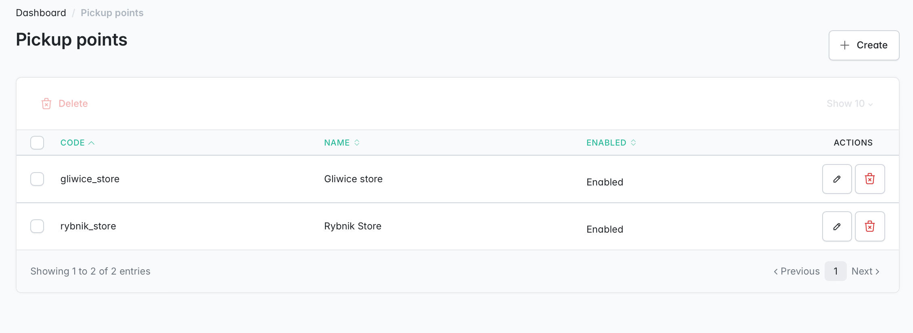
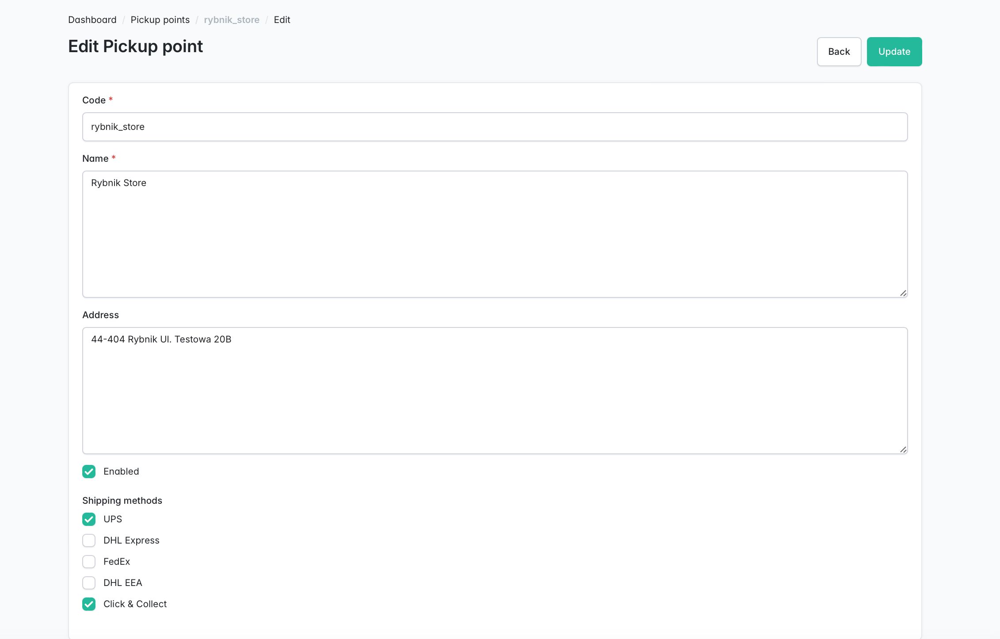
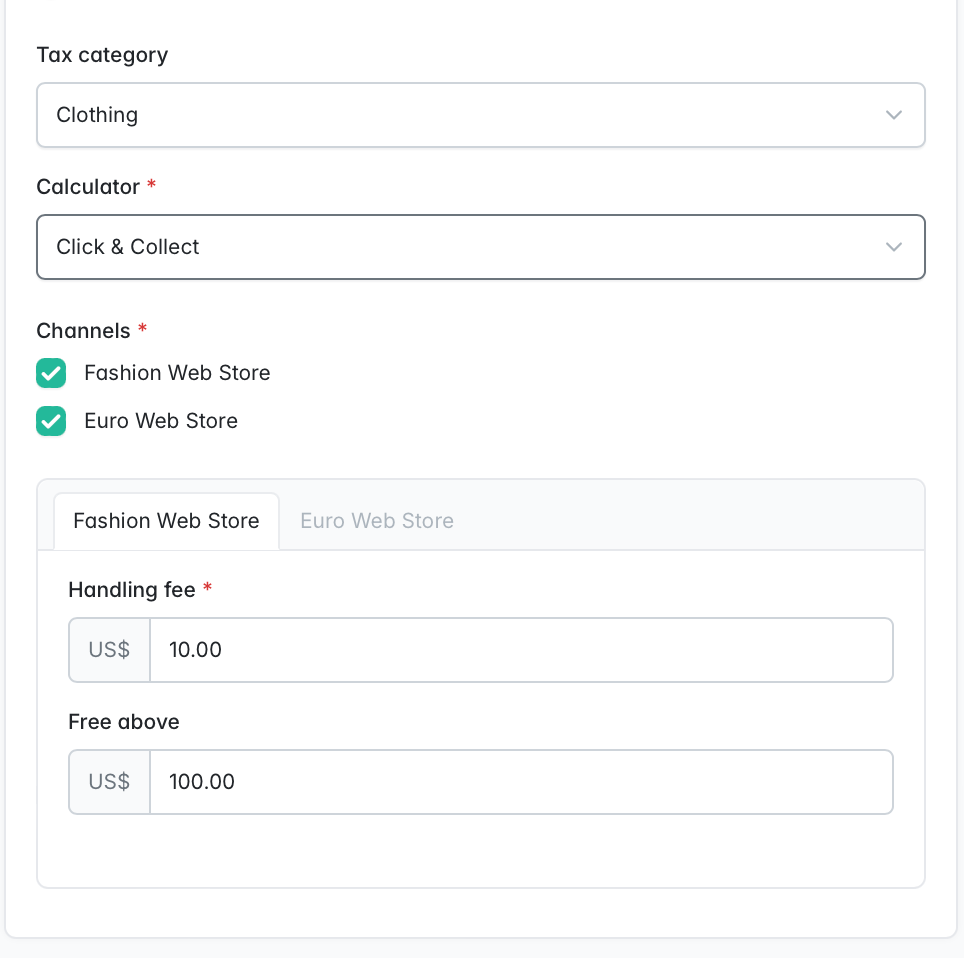

# Sylius Click & Collect Plugin (with Pickup Points)

A custom Sylius extension that adds a **Click & Collect** shipping method. It allows customers to choose a specific physical store (Pickup Point) during checkout and lets administrators view the selected delivery location directly in the Admin Panel.
For simplicity, the entire codebase for this feature is implemented directly in the `src/` directory rather than wrapping it into plugin.

This feature was developed (blindfold) using **BDD (Behavior-Driven Development)** with Behat.

## Running tests

The project includes both **Behavior-Driven Development (BDD)** integration/e2e tests using Behat and isolated **Unit tests** using PHPUnit to ensure the calculator logic is correct.

You can run the entire test suite using the following commands:

### 1. Integration/E2E Tests (Behat)
To test the full customer checkout journey and admin panel visibility features:
```bash
./vendor/bin/behat ./features/shipping
```

### 2. Unit Tests (PHPUnit)
To test the ClickAndCollect shipping calculator logic, handling fees, and threshold calculation in an isolation:
```bash
./vendor/bin/phpunit ./tests/Unit/ClickAndCollect
```

## Application Flow (Screenshots)

### 1. Checkout - Shipping Method Selection
When the customer chooses shipment with pickup points, a dynamic dropdown appears allowing them to select a physical store.
> 

### 2. Admin Panel - Order Details View
Administrators can see the designated delivery location directly under the shipment details in the admin panel.
> ****


## CRUD & Shipping method configuration (Screenshots)

### 1. Menu modification


## 2. Pickup points grid


## 3. Pickup points details


## 4. Shipping method configuration


## 5. Code outside ClickAndCollect module

### 1. Database & Core Model Extensions

- **`App\Entity\Shipping\ShippingMethod` (Extended):**
  Extended to establish a relation with available pickup points. This allows administrators to link specific physical stores to "Click & Collect" shipping methods.

- **`App\Entity\Shipping\Shipment` (Extended):**
  Extended to store the specific pickup point chosen by the customer. It introduces a Many-to-One relationship to our new `PickupPoint` entity:
  ```php
  // src/Entity/Shipping/Shipment.php
  
  public function getPickupPoint(): ?PickupPoint;
  public function setPickupPoint(?PickupPoint $pickupPoint): void;

### 2. UI & Templates
* **Shop Checkout Selection:**
    * * **File:** `templates/checkout/select_shipping/pickup_point_field.html.twig`
    * **Purpose:** Injected into the shipping method form. It uses a lightweight template to display the store selection dropdown only when the shipping method has pickup points.

* **Admin Order View:**
    * **File:** `templates/admin/shipment/show/pickup_point.html.twig`
    * **Purpose:** Injected into the administration shipping details page. It renders card inside the admin order details page, showing admins exactly where the order should be prepared.
